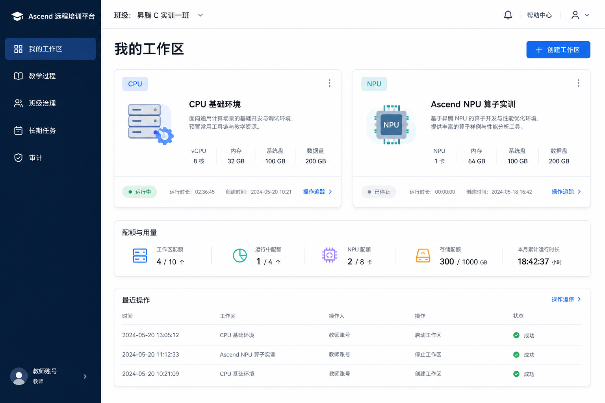
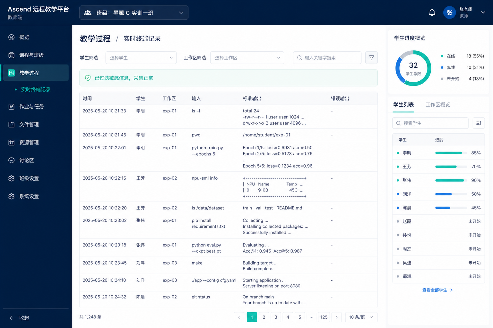

# 前端原型设计：昇腾算子远程实训平台一期

## 范围与边界

前端是 Next.js BFF 与展示层，只消费 [一期控制面契约](contracts/phase1.openapi.yaml) 的授权结果；
不直连数据库、运行时或存储，也不以隐藏菜单代替授权。当前信息架构按 DDD 的 Class、Workspace、
Terminal、Task 和 Audit 读模型组织，权威写入、范围判断和操作状态均来自控制面。

前端设计、断点、受管组件和加载状态以 [前端 UI 契约](contracts/frontend-ui.md) 为准。它不增加或修改
控制面字段；权限、错误、操作状态和数据归属仍以 OpenAPI 契约为唯一来源。

## 视觉系统与 12 栏响应式布局

- 使用 Tailwind CSS mobile-first class。共享 `AppShell`、`PageContainer` 与 `ResponsiveGrid` 分别拥有
  导航、最大宽度/边距和 `grid grid-cols-12 gap-4 md:gap-6`；页面禁止复制这些基础布局规则。
- 手机默认所有主要内容 `col-span-12`，导航收进 Sheet；`sm` 可将概览卡分为 `col-span-6`；`md` 可使用
  3/9 导航/内容或 6/6 区块；`lg` 允许 3/3/3/3 指标和 8/4 详情操作区；`xl` 允许终端筛选/记录 3/9。
  宽表必须有窄屏摘要、关键字段优先级或受限 ScrollArea，禁止整页横向滚动。
- 基础交互使用受管 shadcn/ui（底层 Radix UI）的 Button、Card、Badge、Table、Dialog、AlertDialog、
  Sheet、Select、Tabs、Tooltip、Form 与 Skeleton。业务组件只组合这些 primitives 并添加领域语义，不得
  手写焦点陷阱、键盘导航、菜单定位或基础 ARIA 行为。
- 图标、颜色与文本共同表达状态；危险动作通过 Dialog 明示后果，提交期间锁定重复提交。

## Skeleton 预加载与异步状态

- 每个 route segment 提供 `loading.tsx`，先显示不含班级、用户、工作区数量或权限信息的 shell Skeleton。
- 班级、工作区/额度、操作历史、终端、任务和审计区块各自通过 `Suspense` 流式完成；fallback 必须保持最终
  Card、字段组或表格行相同的跨栏与尺寸，避免 CLS。大体积 Client Component 可用动态导入。
- Skeleton 为装饰性，加载区使用 `aria-busy`；尊重减少动画偏好。`empty`、`not-disclosed`、`error` 和
  `pending command` 不是 Skeleton：不可枚举错误不显示资源线索；命令 pending 保留已加载内容、禁用重复
  按钮并展示安全的操作状态/关联 ID。

## 信息架构

```text
班级切换器
├── 我的工作区
│   ├── CPU/NPU 工作区列表
│   ├── 创建工作区弹窗
│   ├── 详情、操作历史和持久数据
│   └── 重置 / 删除数据处置弹窗
├── 教学过程（教师/授权助教）
│   ├── 班级进度
│   ├── 终端记录实时/历史查询
│   └── 终端记录详情
├── 班级治理（教师/授权管理者）
│   ├── 成员
│   ├── 角色、权限与范围绑定
│   ├── Profile 与额度
│   └── 培训期结束、导出与清理确认
├── 长期任务（具备任务权限）
│   ├── 任务列表与详情
│   ├── 提交任务弹窗
│   └── 任务访问分配弹窗
└── 审计与基础运维可见性
```

## 已生成的关键页面设计

### 我的工作区



页面只列出当前班级和当前主体有权查看的工作区。创建入口展示批准 Profile、CPU/NPU 类型和可用额度；
提交后持久保存幂等键并跳转到 Operation 状态，不在浏览器推测运行结果。

### 教学过程：终端记录



教师/授权助教可按学生、工作区、时间和流向筛选过滤后的记录及采集缺口。页面不能展示跨班级数据、
原始敏感片段或未授权 Task Workspace 记录。

## 页面与弹窗设计清单

每项均必须有独立设计图，禁止以多页面拼贴替代；以下清单是实现前的原型验收范围：

| 类型 | 视图 | 关键交互/状态 |
|---|---|---|
| 页面 | 工作区详情与操作历史 | 操作 ID、generation、安全失败、可重试性、卷状态。 |
| 弹窗 | 创建工作区 | 班级、CPU/NPU Profile、额度、名称冲突与幂等提交。 |
| 弹窗 | 默认重置确认 | 明示清除非持久内容、保留数据并在成功后运行。 |
| 弹窗 | 删除与数据处置 | 强制选择保留或删除数据；删除卷失败仅显示自动协调。 |
| 页面 | 班级成员 | 成员状态、跨用户操作主体与范围。 |
| 页面/弹窗 | 角色、权限与绑定 | 可扩展 RBAC，绑定必须展示平台/班级范围。 |
| 页面 | Profile 与额度 | CPU/NPU 分别展示批准、启用、可用额度和节点/队列提示。 |
| 页面/弹窗 | 培训期结束与清理 | 停止、保留、导出、管理员显式清理及最终结果。 |
| 页面/弹窗 | 长期任务 | 独立 Task Workspace、状态、访问分配/撤销；不得出现服务发布选项。 |
| 页面 | 审计与运营 | 班级审计、拒绝访问、操作积压、健康与采集缺口。 |

## 状态、可访问性与验证

* 无权限与资源不存在使用同一不可枚举界面；前端不暴露目标存在性。
* 操作冲突显示当前 Operation，网络重放复用相同幂等键；旧响应不能覆盖控制面新状态。
* 文字、颜色和图标共同表达状态，键盘可操作对话框，危险动作有焦点管理和明确后果。
* 组件测试覆盖权限可见性、CPU/NPU Profile、创建/删除、操作轮询、终端过滤、任务分配和不可枚举错误。
* 端到端测试覆盖双班级隔离、三种访问入口、培训期结束、Task Workspace 独立性和审计证据。
